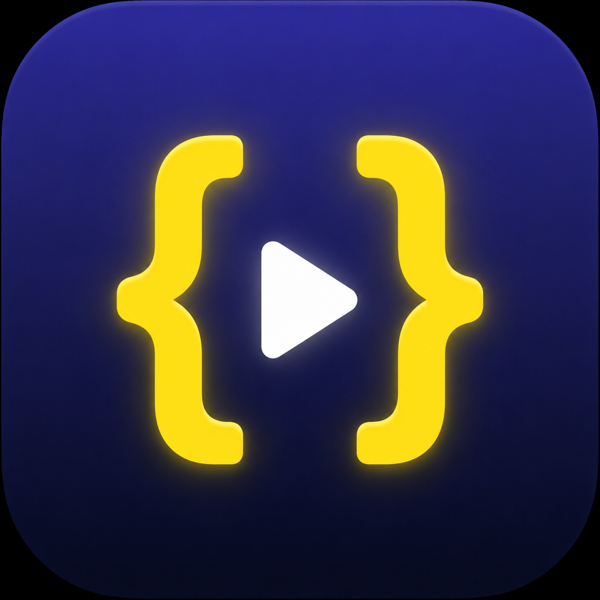
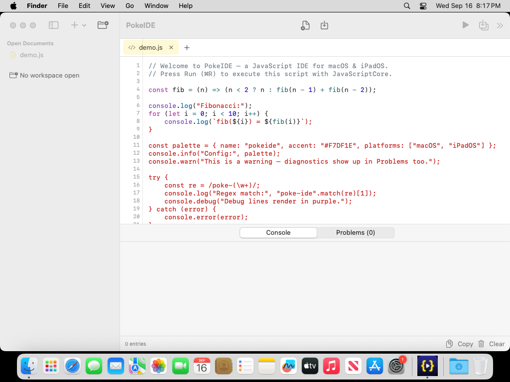
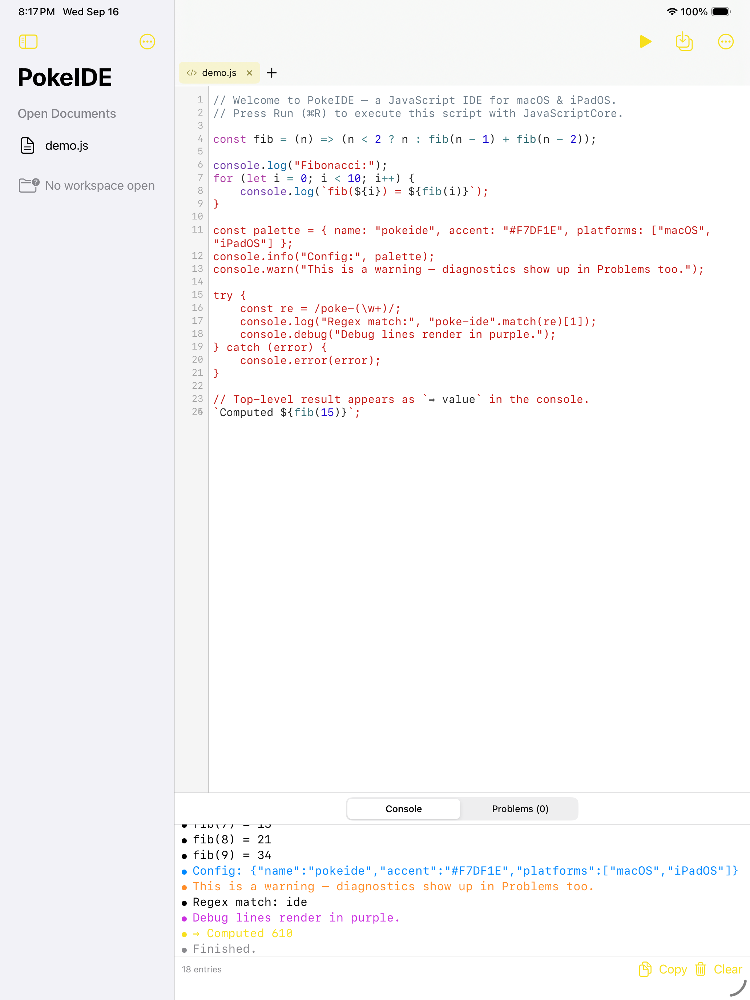
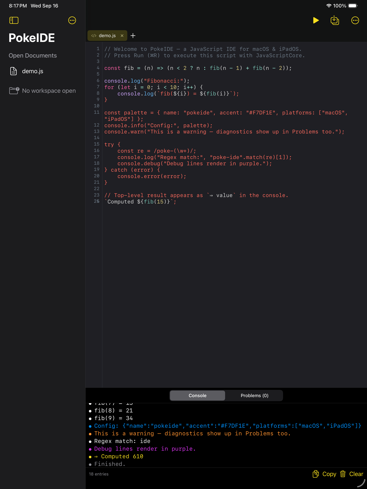

# PokeIDE

A JavaScript IDE for **macOS** and **iPadOS**, built with Swift and SwiftUI on a
shared multiplatform architecture. Write, run, and debug JavaScript locally with
Apple's embedded **JavaScriptCore** engine — no network, no external runtime.



## Screenshots

| macOS | iPadOS (light) | iPadOS (dark) |
|---|---|---|
|  |  |  |

## Features

- **Code editor** with line numbers, tab-to-spaces, auto-indent, and undo —
  `NSTextView` on macOS, `UITextView` (TextKit 1) on iPadOS
- **JavaScript syntax highlighting** via a hand-written lexer (`JSTokenizer`) —
  keywords, builtins, strings, template literals with `${ }` interpolation,
  regex literals (with a regex-vs-division heuristic), comments, numbers,
  function calls and member properties
- **Tabs** for multiple scripts, with dirty-state indicators
- **Project/file browser** — open a folder as a workspace, create/rename/delete
  files, last-workspace restore via security-scoped bookmarks
- **Run ▶ / Stop ■** controls — each run evaluates in a fresh `JSContext`
  (isolated, safe, embedded)
- **Console panel** — `console.log/info/debug/warn/error`, `print()`, and the
  top-level result value (`⇒ …`), color-coded with copy/clear
- **Problems panel** — live syntax checking while you type plus runtime
  exception diagnostics with line/column; tap a diagnostic to jump to the line
- **Import & export** — multi-file import, folder open, Save/Save-As, and
  `.js` document-type registration so files can be shared to the app
- **Keyboard shortcuts** — work on macOS and on iPad hardware keyboards
- **Dark & light appearance** — adaptive palettes for the editor and UI

## Requirements

- Xcode 16+ (macOS 15+ recommended for development)
- Targets: **macOS 14+** and **iPadOS 17+** (iOS 17+ also works)
- [XcodeGen](https://github.com/yonaskolb/XcodeGen) (`brew install xcodegen`)

## Build & run

```bash
git clone https://github.com/CommunityPokeOrg/swift-js-ide.git
cd swift-js-ide
xcodegen          # generates PokeIDE.xcodeproj from project.yml
open PokeIDE.xcodeproj
```

Choose the **PokeIDE-macOS** scheme to run on your Mac, or **PokeIDE-iOS** with an
iPad simulator. From the command line:

```bash
xcodebuild -scheme PokeIDE-macOS -destination 'platform=macOS' build
xcodebuild -scheme PokeIDE-iOS -destination 'platform=iOS Simulator,name=iPad Pro 13-inch (M4)' build
```

## Tests

The shared core (`EditorCore`) is a SwiftPM package with XCTest coverage for the
tokenizer, workspace/file operations, diagnostics, and the JavaScriptCore engine:

```bash
cd Packages/EditorCore
swift test
```

On Linux the engine tests are skipped (`#if canImport(JavaScriptCore)`) and a
stub engine is used; everything else runs portably.

## Keyboard shortcuts

| Action | Shortcut |
|---|---|
| Run script | ⌘R |
| Stop | ⌘. |
| New script | ⌘N |
| New file in workspace | ⌘⌥N |
| Open folder | ⌘⇧O |
| Import files | ⌘I |
| Save | ⌘S |
| Export current | ⌘⇧E |
| Close tab | ⌘W |
| Clear console | ⌘K |

## Architecture

```
swift-js-ide/
├── Packages/EditorCore/          Shared core — platform-free, unit-tested
│   ├── Sources/EditorCore/
│   │   ├── JSTokenizer.swift     Hand-written JS lexer for highlighting
│   │   ├── HighlightTheme.swift  Dark/light token palettes
│   │   ├── JSEngine.swift        JSEvaluating protocol + JavaScriptCore impl
│   │   ├── Workspace.swift       FileTree + ScriptDocument models
│   │   ├── Console.swift         Console entries & levels
│   │   └── Diagnostics.swift     Error/warning model
│   └── Tests/EditorCoreTests/
├── App/
│   ├── PokeIDEApp.swift          @main scene + CommandGroup/CommandMenu
│   ├── Sources/
│   │   ├── Model/                AppState (tabs, workspace, run, diagnostics)
│   │   ├── Editor/               CodeEditor + LineNumberedTextView
│   │   ├── Views/                Sidebar, tab bar, console, problems, welcome
│   │   └── Platform/             Platform shims + SyntaxHighlighter
│   └── Resources/                Assets, Info.plist, entitlements, demo.js
├── project.yml                   XcodeGen spec → PokeIDE.xcodeproj
└── .github/workflows/ci.yml      macOS CI: builds both platforms, runs tests,
                                  captures simulator screenshots
```

### The JavaScript runtime

`JavaScriptCoreEngine` wraps `JSContext`/`JSVirtualMachine`:

- Each **Run** creates a fresh context on a dedicated serial queue — UI never
  blocks, and runs can't leak state into each other.
- `console.*` and `print` are bridged to native handlers (objects are
  `JSON.stringify`ed); uncaught exceptions and thrown errors become diagnostics
  with source line/column via the error object's `line`/`column` properties.
- `checkSyntax` uses the `JSCheckScriptSyntax` C API for live, parse-only
  problems without executing code.

### Limitations

- **Stop semantics:** JavaScriptCore can't interrupt a running evaluation with
  no bridge calls (e.g. `while (true) {}`). Stop detaches the context and
  discards its output; scripts that call `console.*` abort at the next call.
  Truly infinite synchronous loops may keep a background thread busy until the
  app exits.
- **No DOM or Node APIs** — this is a pure ECMAScript sandbox (`setTimeout`,
  `fetch`, `require` etc. are not provided in the MVP).
- Line numbers and syntax highlighting are whole-document (fine for typical
  script sizes; very large files aren't incremental yet).
- On iPadOS, workspace persistence relies on document-picker bookmarks; if a
  bookmark goes stale, re-open the folder.

## Linux / non-Apple testing

`EditorCore` builds and tests on Linux (`swift test`) — the tokenizer, workspace
and diagnostics are platform-free. A Linux UI/testing path (SwiftCrossUI-based
rendering) lives in `Packages/LinuxRunner/`; see its README for status and
limitations.

## License

MIT — see [LICENSE](LICENSE).
